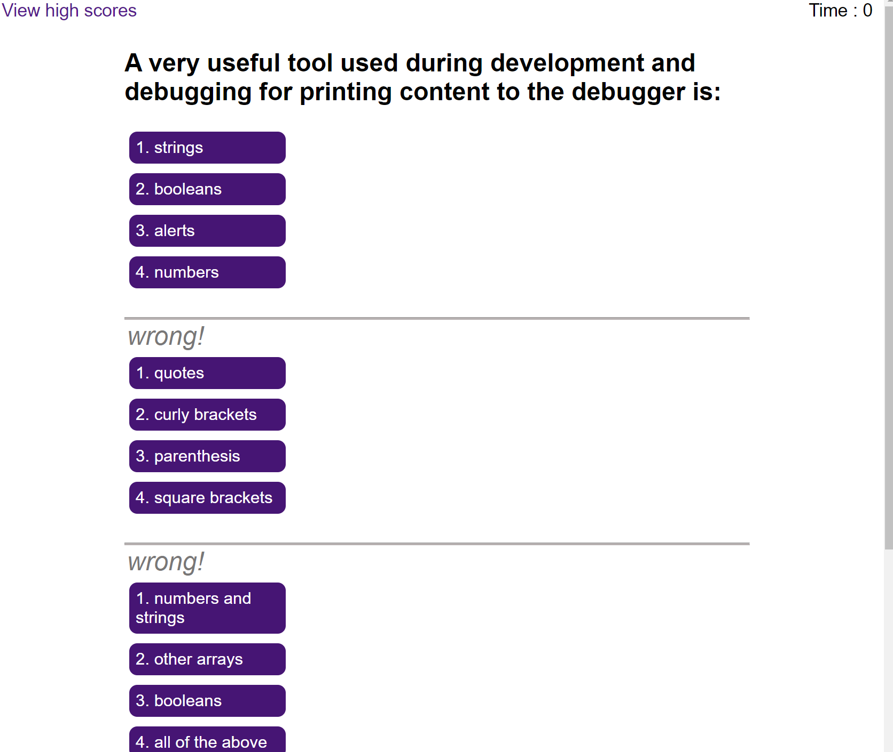

# Interactive Coding Assessment

## Description

This is web application for conducting a timed quize on JavaScript fundamentals that store high scores so that Job applicant's or students can gauge their progress compared to others. When the start quiz button clicked and the timer starts and users will be presented with question. when they answer the question correcty then they will be presented with another question else if they answer incorrectly then 10 seconds will be substracted from the clock. when all the questions are answered or the timer reaches 0 then the game will be over and then they can save the score with their initials.

## Installation

N/A

## Usage

To use this Interactive Coding Assessment, you can open it with the most popular browser such as Google Chrome, Firefox (Mozilla), Edge and so on...

## Credits

N/A

## Link to the APP

https://github.com/bberaki2008/interactive-coding-assessment

## Screenshot

